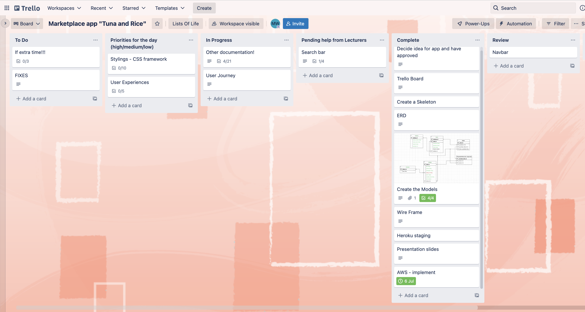

<h1>Tuna&Rice</h1>

A Ruby on Rails Marketplace Project - created by: Megan Van Der Weide
To view in Heroku

Url : https://tuna-and-rice.herokuapp.com/

Github RepositoryUrl : https://github.com/MeganJade5/MeganVanDerWeide_T2A2

<h2>Instructions to Setup, Configure and Use the App</h2>

**Installing Ruby:**
* Ensure Ruby is installed by entering the following command in Terminal: ruby —version
* If a valid Ruby version is not returned, refer to the following link to install Ruby for your operating system: https://www.ruby-lang.org/en/downloads/

**Installing PostgreSQL:**
* Ensure PostgreSQL is installed by entering the following command in Terminal: `psql —version`
* If a valid version of PostgreSQL is not returned, refer to the link below to install PostgreSQL for your operating system: https://www.postgresql.org/download/

**Downloading the Application:**
Navigate to the GitHub repository as linked above; and
Either clone or download ZIP of the application.

**Installing Gems:**
* Ensure you have Bundler installed by opening Terminal and entering the following command: bundler —version
* If Bundler is not installed and an error is returned, enter the following command to install: gem install bundler
Navigate to the root directory of the application and install the required gems with: `bundle install`

**Running the Application on your localhost:**
* Clone the app
* Ensure you are in the application's root directory and enter the following command to run the application within your browser: `rails s`

<h2>Identification of the problem you are trying to solve by building this particular marketplace app.</h2>

The purpose of Tuna and Rice arose when I, as a developer came to realise the lack of platforms that reduced food wastage whilst increasing the community spirit of helping others. This application aims to fill the gap in the market of hospitality venues and everyday households discarding their leftovers and to instead donate or sell these. This may be at a small fee for the seller to obtain money for the leftovers. This two sided marketplace allows for the seller to earn extra money that may become food wastage if sold at whole sale cost, increase their morale of helping others in the community, help to reduce their communities poverty and helps the environment by reducing wastage. 

In Australia we have 13.6% of those living below the poverty line, which translate to a single adult living on $426.30 a week. This means there are 3.24 million people living in poverty. A study of 12,000 students revealed that 21 percent had an income of less than $10,000 annually, with further statistics of two-thirds living below the poverty line. The study also revealed that one in five students go without a meal. These facts encouraged the apps purpose, to use leftovers or a home cooked meal to feed users living below the poverty line or those users who may be struggling to make ends meet. 
[REFERENCE](https://gupsa.org.au/two-thirds-of-university-students-living-below-the-poverty-line-report/#:~:text=Universities%20Australia%20surveyed%20close%20to,was%20%2418%2C634%20for%20undergraduate%20students)

Having an outlet where users are able to sign up to locate unused food aims to desensitise asking for help, if the user is struggling to make ends meet and feed themselves. The application allows for “buyers” to obtain food at a discounted cost with Tuna and Rice encouraging “sellers” to post the meals for free. This two sided market place allows for a buyer to obtain help, feed themselves. As most healthy food can be costly and unattainable for those in poverty, most would reach for unhealthy but cheaper food options. Tuna and Rice would allow for buyers to increase their health by being able to obtain healthier meal options. 

In addition the marketplace breaks the barrier of creating relationships for the user and buyer. The app establishes the relationships between the seller and the buyer because for the buyer to obtain the meal and pay for it, they must meet the seller in real life at the meals location. This wider world applications use is that it’s introducing the users and buyer within their community. This may allow for the buyer to have continuous food donations or further help in the future from the seller. These relationships could be built through the app in the users community, as having the buyer and seller meet in real life to obtain the meal product, may lead to a continuous relationship.

Whilst other competitors promote buying food boxes, to cook meals, with ingredients specific sizes to reduce waste it does not serve the purpose of helping others. We all feel better about ourselves when we know that we are helping others, and when we are able to see our help in action with real people. This concept of sharing with others is the foundation of human generosity, like sharing sugar with our neighbour, or more recently sharing one of these free food boxes to our friends during the pandemic. This application recognises that everyone could benefit from a meal share specific marketplace that operates on a no/low-fee model. 

The title “Tuna and Rice” comes from the common Australian saying of “we will be eating beans for a week” when a person is referring to spending too much money on other living costs and not having enough money left for food. Instead of eating tuna and rice, a can of beans or bread when we are struggling, this app can provide a home cooked meal. The bonus is that we are tackling our food wastage issues in the process. This is a no-nonsense exchange that relies on the community to utilise it’s platform to achieve this result. 

<h2>Why is it a problem that needs solving?</h2>

Poverty rates are important to solve as it improves life expectancy and affects us all who are not poor. This economic, social and psychological strain from poverty affects individuals and the nation. For an example if a child grows up in poverty, they have less of a chance to be a successful adult. This means businesses may have access to less good workers therefore goods are more expensive. Or the health sector spends more to treat illnesses that this adult may have and citizens feel less safe on the streets as there is more crime. With more crime and more of those in poverty the government pays more for shelters, they hire more police or prison guards and emergency workers are required to respond. The magnitude of cost surrounding the issue goes beyond just the poverty, but is often cause from an individual living in poverty. Reducing poverty would help sole the social injustice and fairness of inequality. 

Increasing human relationships in our community is important because it helps a community thrive as a whole. Whilst this may not be a “problem” in all communities, there is a benefit to improve a community that is already connected. By working together as a community, individuals are able to achieve their goals and make an organised effort to change and improve together. By increasing human relationships, there are more people to motivate each other and overcome any challenges or obstacles that they may face. 

Desensitising asking for help is a problem that needs solving. The more we are exposed to something that we are afraid of, the easier it becomes. It takes courage to speak up to a trusted person, as there are not many easy outlets for us as humans to ask for help. By having an easy outlet available there would be more people asking and therefore more confident and less anxious people in our community. By improving the outlets of how people ask for help, we improve persons self-esteem and reduce them neglecting their personal needs. In addition it builds connections by having peoples share their information, resources and regain a positive or new perspective. 

Improving our health through eating healthy needs solving as our society is is developing illnesses from being overweight. The biggest cause of unhealthy eating habits is poverty and a lack of access to nutritional foods. The effects of an unhealthy diet include tooth decay, high blood pressure, diseases, diabetes, high blood pressure and shorter life expectancy. In result we have larger health costs from these health effects and a reduced job performance as we as a society are becoming slower in the workplace from our health. To be a better society, we need to eat healthier. 

Reducing food wastage can help the environment, save money and fight world hunger.
Our trash goes to landfill and most cannot properly decompose in a landfill from other materials trapping the food wastage from the earth. In result we have more methane greenhouse gas emissions which are not environmentally friendly and therefore increases our climate changes. In addition a food reduction means more money saved as instead of buying too much and waisting it, we save this money. Most importantly reducing food waste can help fight world hunger. This food is wasted in any way that’s not consumed ie. food being rejected for consumers, falling off a truck, being destroyed, too much grown that cannot be consumed whilst fresh or food being cooked or just unused and thrown out. Instead we can end world hunger by donating the food that we waste. 

In addition our geographical living on deserts mean that some don’t have access to fresh produce. These people are eating prepackaged food that doesn’t have traditional value and therefore only feel the sensation of being full. Therefore it’s important to have access to this nutritional food, which is solved through this application. 

The application gives the user the ability to assist in solving and improving the efficiency of these issues.

<h2>Functionality / features</h2>

View listings - All Users can browse all listings, whether signed in or not. Anyone can view the listings, including the price and condition of individual listings. Simple design where users can use a trusting service to locate affordable to donated food in their location. The prices of all listings of the meal are displayed on the page of that meal

Create listing - a signed in user can create a meal listing with an image. The location is displayed from the users address. Users who wants to advertise a meal needs to sign up to become a seller by providing necessary information

User Authentication - user can create a profile, edit their profile and sign in and out in new sessions
Create an account for users to be able to store information.
Multiple users supported with personal profiles that can be edited.

Security -  prevents users from editing or deleting listings which are not theirs, and accessing profiles which are not theirs

Edit or delete listing - a signed in user can edit or delete their meal listings
Purchase - a signed in user can purchase a meal that’s not their own
View bought and sold orders - a signed in user can view their own meals that they have bought and meals that they have sold
Option search - any user (signed in or not) can search listings according to their title or locations 

Responsive website design to allow for all screen sizes.

<h2>Sitemap</h2>

<h2>Screenshots</h2>

<h2>Target audience</h2>

This application is for all food lovers, people who eat food and people who want to reduce the impacts on the environment. It is also for people who want to connect with their community, meet people and help others. 

This application aims to target those needing or wanting to obtain meals at a low cost. It gives peace of mind to the users to have an outlet of being able to ask for help if they’re struggling in poverty. It gives peace of mind for the users to obtain food before reaching their next pay day. 

Additionally, the site targets hospitality venues or individual people who want to reduce their food wastage. This is an opportunity to make a profit on things they’re already throwing out or provide them with a platform to donate to real life people in need. In addition it promotes the hospitality venue as helping their community. 

<h2>Tech stack (e.g. html, css, deployment platform, etc)</h2>

* Ruby (2.7.5)
* Ruby on Rails (6.1)
* PostgreSQL
* Heroku
* CSS 
* HTML
* Amazon Web Service (S3)

<h2>User stories for your app</h2>

Seller refers to a consumer that uses the application to meals they wish to sell or donate and buyer refers to someone who wishes to purchases or obtain a meal listed by the seller.

* As a user I want to be able to view the list of meals for sale, so I can browse and decide if I want to buy or sell
* As a user I want to be able to sign up, so I can buy or sell a meal
* As a user I want to be able to login with my existing account, so that I can enjoy the easy service and repeat my buy or sell action
* As a user I want to be able to change password if i've forgotten it, so that I can access my account
* As a user I want to be able to edit my profile to change my details, so that I * have relevant personal information (especially location) to buy or sell
* As a user I want to be able to remove my account so there will be no copy of information stored in the website if I no longer want my account
* As a user I want to be able to learn more about (on the about page) how the process of selling or buying/receiving meals works on the application, so that I understand how to use the application
* As a user, I don’t want anyone unauthorised to edit, buy or sell under my profile so that I have security and control over my profile
* As a user I want to have access to edit my profile to update personal information on the site

**As a seller:**

* As a user I want to make an account so that my information is associated with all of my actions of selling items
* As a user I want to login in so I can list a meal to sell or donate.
* As a user I want to be able to sell or donate my unused meals so that I can recoup some costs or help others in need
* As a user I want to be able to list my meals with photos, pricing, specifications and information about the ingredients of my meal so that my buyer knows what they’re getting
* As a user I want to view all of my advertisements so that I can see what I have posted onto the application and list mine accordingly
* As a seller, I want to be able to see the prices of other meals, so that I may set an appropriate price for my own
* As a user I don’t want anyone unauthorised to edit/delete or update my listings but me so that I have control over my own profile

**As a buyer:**

* As a user I want to login to order and buy or obtain a meal so that I can utilise the applications service 
* As a user I want to be able to find meals based on location and specific dates so that I can pick up my orders
* As a user I want to be able to filter/search my results based on specific item details of title and/or location so that I can find my desired meal

<h2> Skeleton Planning </h2>

<h2>Wireframes for your app</h2>

<em> The following were idealist images using CSS, this was not the final outcome.</em>

<h2> ERD - Entity Relationship Diagram </h2>

<h2>Explain the different high-level components (abstractions) in your app</h2>

This marketplace is created with Ruby on Rails and the PostgreSQL database. By utilising the model-view-controller (MVC) to create the separation of concerns and applies a API to define which methods are available.

**The database**
This is used to hold the data within the application. This ensures that the data is kept between sessions. By having a database, information can be saved beyond temporary memory storage which would loose the users data between sessions. The data in the application is saved in the database in rows (records) and columns (attributes) in a spreadsheet form called a table. Some of the tables included are users and address, which store information regarding the users and the users addresses respectively.

**Routes**
This is used to direct where information is to flow between the models, controllers, and views, and which HTTP verbs are available on which endpoints. These are arranged in rails using API architecture.
Routes are declared in the 'routes.rb' file in the config directory. The verbs, controllers, and methods declared in the routes file determines which controllers, methods within those controllers, and views.

**The model**
The database is accessed via the model, which is the connection to pass the information along to the controller. In Rails, the model must be named the singular version of the table to which it refers. The model inherits from the ApplicationRecord class. For example the model for the allergies table must be called 'allergy.rb' by convention and placed in the app/models directory.
If these conventions are met, many instance and class-instance methods are made available on the Allergy class. Methods available on the class itself have the ability to create (.create), view all instances of the class (.all). Where as the instance of the class are able to edit (.update) and destroy (.destroy).

**The view**
The view displays the interface to users. In this application each webpage has a view. Views are intended to contain logic and simple conditionals. For example the view contains a conditional to show a ‘sign in' button if the user is logged out, but a ‘sign out' button if the user is logged in.
‘Views’ are saved in the app/views directory, and then inside another directory with the name of the specific page's controller. For example if the model was called 'listing.rb', the controller would be called ‘listings_controller.rb’. Each hold the name of the methods within the controller ie. there is a method called 'show' in ‘listings_controller.rb' and a view called 'show.html.erb'.

**The controller**
This contains the logic of the program and it connects the model and view, to show information retrieved from the database to the user.
Controllers are saved in app/controller and are named with the plural of the model it interfaces with. For example if the model is called 'user.rb', the controller would be called ‘users_controller.rb' and the controller is declared, which inherits from ApplicationController. This rule of naming allows the application to have access to its inherited methods and helpers.
The tasks performed by this controller are passing information regarding groups or individual listings to the relevant views so that they may be displayed to the user.

---------------------------------------------------------------

Example of the architecture that has been generated to demonstrate different components being used at various stages:
The User model - a user interacts with this to create an account before they can access the application's features of buying or selling listings. It determines the form for inputing the data to be saved into the database. Once validated by the model, that data is saved into the Users table within the database.
When the user clicks on a meal listing, the listings controller will accept the ID of the listing as a parameter and pull the meal listing from the database that has matched the parameter. That information is passed from the database, through the controller, to the view where it is displayed to the user.
Devise gem generated the user model which that handles the authentication of the application. Firstly the Listing model (controlled by its corresponding Listings controller) will show all listings regardless if you have created an account or not. If the user wishes to purchase a meal, it will trigger an authentication if you choose to purchase. With the help of Devise it has in built helpers such as 'before_action :authenticate_user!’ And once logged, users can make an order of the meal. 

<h2>Detail any third party services that your app will use</h2>

**Heroku**
* used it to host the application for testing and deployment of app
* container-based cloud Platform as a Service (PaaS)
* to deploy, manage, and scale modern apps
* Is flexible and easy to use
* handles all of the routing through the use of web, worker and one-off dynos Incoming requests handled by sending them to a load balancer that offers SSL (Secure Socket Layer) termination and returns a success message to the user
* https://www.heroku.com/

**GitHub**

* hosting service
* command line tool, GitHub provides a Web-based graphical interface
* provides access control and several collaboration features
* Used for version control and project managment 
* https://github.com/

**AWS S3**
* web-based cloud storage service designed for online backup and archiving of data and applications on Amazon Web Services. 
* is a scalable and high-speed
* Has minimal feature set and created to make web-scale computing easy
* works by creating a 'bucket' on Amazon web services which files can be uploaded to
* used for file uploading images on the site when users add a new listing 
* https://aws.amazon.com/s3/

**PostgreSQL**
database used and created by code:
`rails new project_name -d postgresql`

* Free! With no royalties or licensing costs. Therefore there is no restrictions of project scopes and it can be shared as it’s publicly accessible
Open source and developers can develop own modules for the community “Permission to modify, and distribute this software and its documentation for any purpose, without fee and without written agreement” [REFERENCE](https://opensource.org/licenses/postgresql)
* Reliable - Compliant with ACID design principles (atomicity, consistency, isolation and durability). This is to ensure the database transactions are processed reliably. These principles secure PostgreSQLs operations are resilient. This helps protect the system from faults, crashes, failed transactions and unexpected hardware & software interruption.
* Scalable- it allows startups to grow without worrying about switching over to a privatised database system.
* Extensibility - the design allows for the addition of new capabilities or functionality. It includes an extensive library of additional plug-ins for more optimisation
* Has data integrity 
* Well documented and supported by industry professionals 
* It is maintained by skilled developers, therefore stays up to date and improvement are made to the cod
* Features like table inheritance and function overloading
* Built-in security features such as data base file protection. Client connections may be authenticated via external packages. In addition users might be given restricted access according to their assigned to groups privileges  [REFERENCE](https://www.postgresql.org/docs/7.0/security.htm)

**Gem - Devise**
* a flexible authentication solution for Rails
* used it for authentication: generate the users table in the database, user model, controllers (not in the rails files), and views relating to signing in, registering, and resetting passwords.
* Function used to make 'current_user' variable available, which makes it much easier to attach other objects such as listings, addresses, and images to a specific user. 'current_user' also be used in displaying different information to different users depending on which user is logged in, ie. meals sold or bought
* https://github.com/heartcombo/devise

**Gem - RSpec**
* Domain Specific Language testing tool used to test Ruby code
  
<h2> Describe your projects models in terms of the relationships (active record associations) they have with each other</h2>

For all tables, the attributes collected can be viewed in the ERD diagram in the following section:

**user**
`class User < ApplicationRecord`
  `devise :database_authenticatable, :registerable,`
         `:recoverable, :rememberable, :validatable`
  `has_many :listings`
  `belongs_to :address`
  `accepts_nested_attributes_for :address`
  `has_many :sold_orders, foreign_key: "seller_id", class_name: "Order"`
  `has_many :bought_orders, foreign_key: "buyer_id", class_name: "Order"`

User Model has one to many relation with the Listing model, and belongs to the Address model. This means the User has many listings but belongs to an address. The user also can have many sold and bought orders. The users table exists to store information regarding individual buyers and sellers on the application. The user table was created using the Devise gem and some of the columns were provided by default.

**Listing**
`class Listing < ApplicationRecord`
  `belongs_to :user`
  `belongs_to :allergy`
  `has_rich_text :description`
  `has_one_attached :image`

Listing Model has many to one relations which is the `belongs_to`. It has a user and an allergy condition. Its saying that each meal Listing belong to both of these. The listings table holds the details of all the meals that have been listed on the website. The table contains foreign keys for both the users and allergy tables.

**Address**
`class Address < ApplicationRecord`
    `has_one :user`

The addresses table exists to store the meal listings address of each user so that buyers know where to pick up the meal. Addresses are associated with users using a foreign key in order to group the address with the sellers profile. 

**Order**
`class Order < ApplicationRecord`
  `belongs_to :listing`
  `belongs_to :buyer, foreign_key: "buyer_id", class_name: "User"`
  `belongs_to :seller, foreign_key: "seller_id", class_name: "User"`

The order table exists to hold information about which meals have been sold. This table holds foreign keys for both the listings, buyer and seller. This allows for the viewer to see what meals they have claimed or sold.

<h2>Discuss the database relations to be implemented in your application<h2>

My goal for the applications database relation was to be efficient in optimising the database through reducing any data duplicates, redundancy, integrity and optimising the possibility of future uses. 
By recognising the relationships among sets of data, stored in tables I was able to form a relational database. This design considered information that the application needed for its purpose and how this data would be stored and/or sorted for easy access. My process of normalisation was to split up the data into smaller tables ie. allergy/user/listing/order to link them with their relationships. 
Each table stores data that is relatable to other tables through foreign keys. Such as the order table draws from the foreign key of seller_id from the user_id. 
The following Entity Relationship Diagram below displays the database design: 

<h2>Describe the way tasks are allocated and tracked in your project</h2>

It was important to me to plan, develop, implement and polish my project through the use of Trello boards. In addition I kept track of my workflow through the use of extended branches for each feature. Firstly my development fazes were placed on a seperate branch to the master branch for best practice. Secondly I followed a process of development as followed; I created a feature branch, I then implemented the features code, then merged this feature branch into the development branch and deleted the feature branch. Upon completion I merged the development branch with the master branch. In addition I implemented the same process with the Heroku app, only it was a staging platform before going to production. 

**Stage 1. Planning**
The first tasks completed were those involved in the planning stage of the project, including:
* The purpose of my application idea
* Why is this a problem that needs solving?
* User stories
* My applications skeleton 
* Wireframes
* Sitemap 
* ERD - what are the relationships between tables
* Consider the dependencies of each feature on other features.

Once these steps were completed and the foundation of the app was determined, the next faze of the rail project commended; coding with rails. 

**Stage 2. Developing the database**
Code was created for:
* generating the database migrations
* writing the associations in models

**Stage 3. Seeding the database**
This was to form the data in the allergy table and implement user options when filling out the form for the meal listing. 

**Stage 4. Basic features**
Development of basic CRUD functionality for listings and users. This was the creation of routes, controllers, and views.

**Stage 5. Authorisation features**
Authorisation features were implemented by providing logic in the controller to avoid any fraudulent information to the website.
This aimed to implement the following;
* users cannot edit or delete listings which are not theirs
* users cannot edit or delete listings which have been purchased
* users cannot access or edit profiles which are not theirs

This was achieved my comparing the user idea of the listing with the current users id. The user was unable to see any options of editing or deleting any listed meal that was not their own. In addition the user was redirected to log in if they were to access a page that required a user id, ie. creating a listing.
The user is prevented from accessing any profile page that is not their own. By using the devise logic all data that loads is related to the current_user. No user can ever see a profile (or access the edit functionality) that is not theirs.

**Stage 3. Testing**
Testing involved making sure the following were possible:
* a user could be created
* an address could be associated with a user
* a listing could be created
* a listing could be associated with a user and the sellers address
* an image could be associated with a listing
* a purchase could be created
* a purchase could be associated with a buyer and seller

**Stage 6. Advanced features**
Once basic features were complete, I added an advanced feature a search option. 
Search was implemented by using a form to send params to the controller, which would then redirect back to the same page. There was then code on the view to display certain information only if there were params which corresponded to the search.
The search bar allows for filtering of the title and location. It could be extended in future by adding a price as a filter option. 

**Stage 7. Polish**
Once the application functioned, the following was tackled:
* styling with CSS
* DRYing up the controllers by creating instance methods in the models
* Image uploads using AWS

**Tasks were tracked using trello (see images below):**

